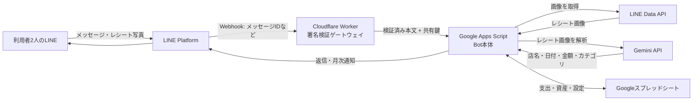
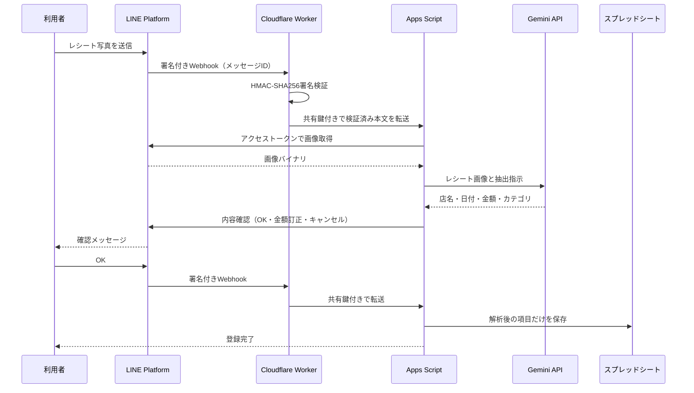

# システム全体解説 — LINE家計簿・資産管理Bot

## 1. このドキュメントの目的

このBotを使い続ける人が、Cloudflareを含む各サービスの役割、データの流れ、セキュリティ、更新・障害対応を把握できるようにするための解説書です。

構築手順は[02_setup_guide.md](02_setup_guide.md)、詳細な設計・データ項目は[01_design.md](01_design.md)を参照してください。

## 2. 一言でいうとどんな仕組みか

LINEを入力画面として使い、支出や資産情報を自分のGoogleスプレッドシートへ保存するシステムです。

- テキスト支出はApps Scriptが直接解析する
- レシート写真はGemini APIに読み取らせ、本人の確認後に登録する
- Cloudflare WorkerはLINEから来た正規の通知かを確認する「受付・警備員」として動く
- データベース専用サービスは使わず、自分のGoogleスプレッドシートを保存先にする

## 3. 全体構成



重要なのは、**レシート画像本体はCloudflare Workerを通らない**ことです。Workerが受け取るWebhookには画像そのものではなく、LINE上の画像を取得するためのメッセージIDが含まれます。画像本体は署名検証後、Apps ScriptがLINE Data APIから直接取得します。

## 4. 各サービスの役割

| サービス | 役割 | 保存するもの |
|---|---|---|
| LINE | 利用者との入力・返信画面。画像を一時保持しWebhookを送る | LINE側の仕様に従ってメッセージや画像を保持 |
| Cloudflare Worker | LINE署名を検証し、正規WebhookだけをGASへ中継 | 永続保存なし。Webhook本文を処理中のメモリで扱うだけ |
| Google Apps Script（GAS） | Botの中心。入力解析、外部API呼び出し、集計、登録を行う | APIキー等をスクリプトプロパティに保存。画像は永続保存しない |
| Gemini API | レシート画像から店名・日付・合計・カテゴリを抽出 | 無料枠では入力・出力がGoogleのサービス改善に使われる可能性がある |
| Googleスプレッドシート | 支出、資産、カテゴリ、設定、ダッシュボードを保存 | 解析後の文字・数値データ。レシート画像は保存しない |

## 5. Cloudflare Workerとは何か

Cloudflare Workersは、インターネット上で短いプログラムを実行するサービスです。このシステムでは、LINEとApps Scriptの間に置く小さなゲートウェイとしてだけ使います。

Apps ScriptのWebアプリはHTTPリクエストヘッダーを公式のイベント引数から取得できないため、LINEの`X-Line-Signature`をGAS単体で確実に検証できません。そこで、ヘッダーを取得できるWorkerが次の処理を担当します。

1. LINEからWebhookを受信する
2. 生の本文と`X-Line-Signature`を、LINEチャネルシークレットでHMAC-SHA256検証する
3. 署名なし・不一致なら`401 Unauthorized`で拒否する
4. 正しい場合だけ、Webhook本文を共有鍵付きの封筒（JSON envelope）に入れてGASへ転送する

Workerは家計簿の計算、スプレッドシート操作、Gemini呼び出しを行いません。役割を署名検証と中継に限定することで、構成を単純にしています。

## 6. 代表的な処理の流れ

### 6.1 テキストで支出を登録

例: `ランチ 850`

1. LINEがWebhookをWorkerへ送る
2. WorkerがLINE署名を検証し、共有鍵付きでGASへ転送する
3. GASが送信者を許可ユーザー2人と照合する
4. GASがメモと金額を解析し、カテゴリを推定する
5. 支出シートへ登録する
6. GASがLINE Messaging API経由で登録結果を返信する

テキスト登録ではGeminiを使用しません。

### 6.2 レシート写真を登録



解析結果はユーザー単位の一時キャッシュに最大30分保持されます。`OK`まではスプレッドシートへ登録されず、キャンセルまたは期限切れで破棄されます。

### 6.3 月次レポート

1. Apps Scriptの時間主導トリガーが毎日9時頃に起動する
2. 設定した配信日でなければ何もしない
3. 配信日なら先月の支出と予算差を集計する
4. 許可された最大2人へLINEプッシュメッセージを送る

## 7. セキュリティの層

セキュリティは一つの対策だけに頼らず、複数の層で守ります。

1. **HTTPS通信**: LINE、Cloudflare、Google間の通信を暗号化する
2. **LINE署名検証**: Workerが偽造Webhookを拒否する
3. **Worker–GAS共有鍵**: GAS URLへの直接POSTを拒否する
4. **2人の許可リスト**: 正規Webhookでも、登録済み2人以外のメッセージを処理しない
5. **秘密情報の分離**: LINEチャネルシークレットはWorker、LINEアクセストークンとGemini APIキーはGASに置く
6. **画像を保存しない**: システム独自のストレージやスプレッドシートへレシート画像を残さない
7. **本人確認フロー**: Geminiの抽出結果を自動登録せず、本人が`OK`してから保存する

レシート画像はGeminiへ送られるため、氏名、住所、電話番号、会員番号、カード情報などは撮影前に隠すか切り取ります。医療など機微性の高い支出は、写真ではなくテキスト登録を使うのが安全です。

## 8. 秘密情報をどこに置くか

| 秘密・設定値 | 保存場所 | 用途 |
|---|---|---|
| `LINE_CHANNEL_SECRET` | Cloudflare Worker Secretのみ | LINE署名検証 |
| `GAS_WEB_APP_URL` | Cloudflare Worker Secret | 検証済みWebhookの転送先 |
| `GATEWAY_SHARED_SECRET` | Worker SecretとGASスクリプトプロパティ | Workerからの転送であることをGASが確認 |
| `LINE_CHANNEL_ACCESS_TOKEN` | GASスクリプトプロパティ | 画像取得、LINE返信、プッシュ通知 |
| `GEMINI_API_KEY` | GASスクリプトプロパティ | レシート解析 |
| `SPREADSHEET_ID` | GASスクリプトプロパティ | 保存先スプレッドシートの特定 |

これらをGitHub、スプレッドシートのセル、LINE、スクリーンショットへ貼り付けません。漏えいが疑われる場合は、該当するSecretやトークンを再発行・再設定します。

## 9. データが最終的にどこへ残るか

| データ | 最終的な保存先 | 備考 |
|---|---|---|
| レシート画像 | 本システムでは永続保存しない | LINEとGemini側の各規約・保存方針は別途適用される |
| 店名・日付・金額・カテゴリ | 支出シート | ユーザーがOKした後だけ保存 |
| LINEユーザーID | 支出シート、設定シート | 登録者識別と配信先に使用 |
| 口座・資産残高 | 資産スナップショットシート | Geminiへは送らない |
| APIキー・共有鍵 | Worker SecretまたはGASスクリプトプロパティ | GitHubには保存しない |

## 10. デプロイと更新の考え方

WorkerとGASは別々にデプロイされます。

### GASコードを更新する場合

1. Apps Scriptへ変更を反映する
2. 「デプロイを管理」から既存デプロイを編集する
3. バージョンを「新バージョン」にしてデプロイする

既存デプロイを更新すればGAS URLは変わらず、Workerの設定変更は不要です。

### Workerコードを更新する場合

`gateway/`でテスト後、次を実行します。

```powershell
node --test
npx.cmd wrangler deploy
```

同じWorker名へデプロイすればWorker URLは変わらず、LINEのWebhook URLも変更不要です。

### GASを新規デプロイしてURLが変わった場合

Workerの`GAS_WEB_APP_URL` Secretを新URLへ更新して再デプロイします。通常は既存デプロイの新バージョンを使い、URLを変えない運用を推奨します。

## 11. 障害時にどこを見るか

| 症状 | 主な確認先 | 代表的な原因 |
|---|---|---|
| LINE Webhook検証が失敗 | Cloudflare Workerログ | LINEチャネルシークレット不一致、Worker URL誤り |
| Botが完全に無反応 | Workerログ、GASの「実行数」 | Worker停止、共有鍵不一致、GAS URL誤り |
| テキストは動くが画像だけ失敗 | GASの「実行数」 | LINE画像取得、Gemini APIキー・モデル・無料枠 |
| 登録はできるが月次通知が来ない | GASトリガー、設定シート | トリガー未作成、配信日・ユーザーID誤り |
| 3人目が反応しない | 設定シート | 仕様どおり最大2人で停止している |

詳細は[02_setup_guide.mdのトラブルシューティング](02_setup_guide.md#トラブルシューティング)を参照してください。

## 12. 費用と無料枠

- Cloudflare Workers Free: 1日100,000リクエスト
- LINEコミュニケーションプラン: カウント対象メッセージ月200通。通常の返信は対象外
- Apps Script個人アカウント: URL Fetch 1日20,000回
- Gemini: Free Tierの有効なRPM・TPM・RPDはGoogle AI Studioで確認

2人の家庭利用では通常十分な範囲です。CloudflareとGeminiをPaidプランへ変更せず、Google Cloudの請求先をGeminiプロジェクトへリンクしないことで、意図しない課金を避けます。最新条件と詳しい注意点は[02_setup_guide.mdの手順9](02_setup_guide.md#手順9-無料運用の上限と注意点)を確認してください。

## 13. この構成の割り切り

- Cloudflare障害または無料上限到達時は、署名検証ゲートウェイを通れないためBotが停止する
- Gemini無料枠ではレシート画像がサービス改善に使われる可能性がある
- レシート確認状態は30分の一時キャッシュであり、長期保存されない
- 利用者は先着2人。2人登録後はQRコードやBot情報を公開しない
- レシート解析には誤りがあり得るため、必ず確認画面を見てから`OK`する

これらは、家庭内2人、無料運用、レシートに個人情報を含めない、という前提で複雑さと安全性のバランスを取った結果です。

## 14. 関連ドキュメント

- [01_design.md](01_design.md): 詳細設計、データモデル、対話仕様
- [02_setup_guide.md](02_setup_guide.md): 初期構築、デプロイ、無料枠、トラブルシューティング
- [03_implementation_plan.md](03_implementation_plan.md): 実装フェーズと受け入れ条件
- [`gateway/`](../gateway/): Cloudflare Workerの実装とテスト
- [`src/`](../src/): Google Apps Scriptの実装
